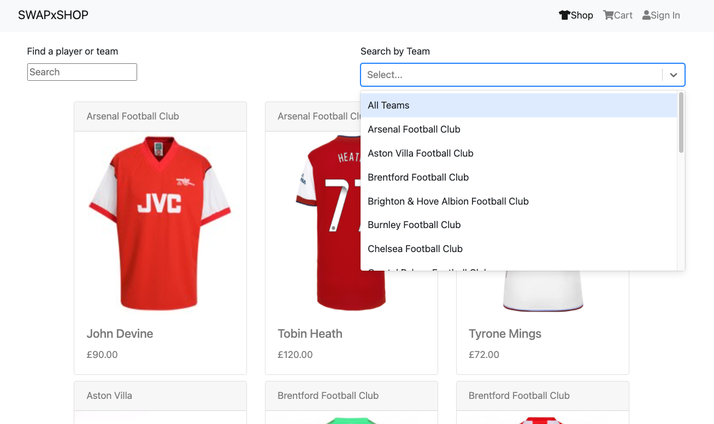

# SWAPxSHOP

## Overview

This was my final project of the course and I had the choice of working individually or as part of a group. I chose to work as part of a pair as this could have potentially been my last opportunity to practise pair-programming skills for a while.

As a pair we decided early on that we wanted to build an e-commerce app as this was not something we had covered on the course and was something we both felt would provide an interesting challenge. We built the SWAPxSHOP app as a marketplace for football fans to sell player jersey's to other fans, it was built with React on the frontend and Python, Django and PostgreSQL on the backend.

This ReadMe will outline the approach we took and the wins and challenges that I encountered along the way.

## Brief

Our brief for this project was to build a full-stack application making our own:

-   Backend with a Python Django API using Django REST Framework to serve our data from an SQL database. 

-   Frontend built with React to consume our API.

The app was also required to be a complete product meaning multiple relationships and CRUD functionality for at least a couple of models.

## Members

[Maggie Ward](https://github.com/MaggieLiz)

[Nnanna Uwakwe](https://github.com/Uwaks)

## Deployment

The live app can be viewed here (link to deployed site)

## Getting started

Access the source code via the 'clone or download' button.

`npm install` - Install dependencies.

`npm run dev` - Run development server.

## Technologies Used

- HTML
- SCSS
- React
- React Bootstrap
- Python/Django
- Django REST Framework
- Insomnia
- PostgreSQL

## Demonstration/cover image 


## User Journey
User Registration


User login


Search items



Item added to cart


Proceed to checkout


## Process

### Planning

Once we had finalised our app idea we moved on to sketching out some wireframes showing user views available to logged in/guest users. We then mapped out all of the relationships we needed to build our various models for the items, users and comments.


### Project management

All of our project management tasks were done on a Trello board


### Backend development

As we both had limited time actually using Python and Django we decided we would pair-code the backend for efficiency as well as to consolidate our understanding of how to set up an API with this stack. This worked well and we had the backend set up and ready to go by end-of-play day 3.

The first thing we tackled on the backend was to create models for all the different entities: items, users and comments. Once this was done we were then able to establish the various relationships: one-to-one, one-to-many and many-to-many, using foreign keys. Below is an example of our items model:

```python
class Item(models.Model):
    player_name = models.CharField(max_length=50)
    team_name = models.CharField(max_length=50)
    image = models.CharField(max_length=250)
    price = models.DecimalField(max_digits=10, decimal_places=2)
    description = models.TextField(max_length=350)
    condition = models.CharField(max_length=50)
    liked_by = models.ManyToManyField(
        'jwt_auth.User',
        related_name = 'liked_items',
        blank = True
    )
    sold_by = models.ForeignKey(
        'jwt_auth.User',
        related_name = 'item_to_sell',
        on_delete = models.CASCADE
    )
    bought_by = models.ForeignKey(
        'jwt_auth.User',
        related_name = 'item_bought',
        null = True,
        on_delete = models.CASCADE
    )

    def __str__(self):
        return f'{self.team_name} - {self.player_name}'
```

The next step was to build out the serializers for each model, setting up the REST Framework and the different requests (Get, Put, Post and Delete) for each entity.

```python
class CommentSerializer(serializers.ModelSerializer):
    class Meta:
        model = Comment
        fields = '__all__'
```

### Data development

For our seed data we used jersey's from current and past players of clubs presently in the English Premier League (season 2021/22) as source of items (2 players per club).

```
{
  "model": "items.item",
  "pk": 48,
  "fields": {
    "player_name": "Jurgen Klinsman",
    "team_name": "Tottenham Hotspur",
    "image": "https://cdn.shopify.com/s/files/1/0188/0122/products/IMG_20200311_110641_grande.jpg?v=1584386042",
    "price": "235.95",
    "description": "Official Umbro Tottenham Hotspur 3rd kit football shirt from the 1991/92 season. Complete with Klinsmann number 18 on the back of the shirt in official flock lettering.",
    "condition": "Excellent",
    "sold_by": 1,
    "bought_by": null,
    "liked_by": []
  }
}
```

### Frontend development

Once we were happy with the backend and having tested all our endpoints with Insomnia, emphasis was moved to building the React frontend. My main responsibility was building the cart component, which was critical to the final mvp status. From the outset, I had to consider the best option for this functionality i.e. a pre-built component or one coded entirely from scratch. Each option presented its own challenges and benefits and I eventually settled on coding one from scratch using my existing knowledge of React Hooks.

The first issue I had to overcome was passing the items added to the cart (the 'Add to cart' button was located on the ItemShow component) to the actual cart component. This proved to be particularly tricky as these two components were siblings, I initially tried to pass these as props between the components (via the parent component) and although this was possible, it wasn't the most elegant way of achieving this.

The solution I eventually settled on was the browser's local storage functionality, which in turn threw up the new challenge of ensuring the items persisted in state in local storage and could be called when required from whatever component the data was needed. I used a combination of the localStorage setItem method and a useState hook with a useEffect hook to solve this.

```javascript
const [cartItems, setCartItems] = React.useState(() => {
    const inStorage = localStorage.getItem('cartItem')
    if (inStorage) {
      return JSON.parse(inStorage)
    }
    return []

React.useEffect(() => {
    localStorage.setItem('cartItem', JSON.stringify(cartItems))
  }, [cartItems])
```

After navigating to the cart or the checkout component, items within the cart could be accessed with a useState constant that uses the localStorage getItem method. This allows access to the cart items with a map or filter method during the render process.

```javascript
const [cart, setCart] = React.useState(JSON.parse(localStorage.getItem('cartItem')) || [])

{cart.map(item => (
  <Container className="cart" key={item.id}>
    <Row className="cart-item">
      <Col>
        <Link  to={`/items/${item.id}/`}>
          
        </Link>
      </Col>
      <Col>
        <div>{item.playerName}</div>
        <div>{item.teamName}</div>
        <div>{item.price}</div>
      </Col>
    </Row>
  </Container>
))}
```

The next issue to overcome was the removal of single items from the cart, which was achieved by utilising the same map method that displayed the cart items either in the cart or checkout component. This solution was not the best as it couldn't handle two of the same items in the cart (if a user accidentally clicked the add to cart button twice) and although it would be unlikely we would have more than one of each item it did highlight an area for UX improvement.

```javascript
<Col>
  <div>{item.playerName}</div>
  <div>{item.teamName}</div>
  <div>{item.price}</div>
  <Button variant="light" 
    className="btn-outline-secondary show-btn"
    onClick={() => removeFromCart(item.id)}>
    Remove from Cart
  </Button>
</Col>
```

The final step in the user journey was actually paying for the item, unfortunately integrating the Stripe API was not possible within the time constraints, however this is a feature we both have decided to attempt at a later date.

## Challenges

The main challenge I came across while developing the back end was the use of serializers to produce our frontend data, whenever there was an issue obtaining certain data the answer was usually to create a new serializer! One particular issue that we came across trying to populate the liked_by and sold_by fields within our item models and actually ended up creating completely new users. We eventually solved this problem by building a new serializer and nesting the existing users within it.

```python
class PopulatedItemSerializer(serializers.ModelSerializer):
    comments = PopulatedCommentSerializer(many=True, read_only=True)
    liked_by = NestedUserSerializer(many=True, read_only=True)
    sold_by = SellerIDSerializer()
    bought_by = BuyerIDSerializer(read_only=True)
    
    class Meta:
        model = Item
        fields = '__all__'
```

On the frontend, the main challenge I encountered was managing the state of the items in the cart. I have detailed my process above, but there are many more elegant ways of solving this problem that actually deal with many downstream issues that arise e.g. UX issues like the cart icon showing the number of items within it are quite complex unless using something like the Context API or Redux.

## Wins

As anticipated, building this app really stretched my programming and problem solving skills; I had to be quite creative with my toolset and also identified areas to work on that would be complementary and take me to new levels.

On the frontend building the cart showed me the state management problems that the Context API and tools like Redux solved, whilst working with Django and a SQL database opened up new horizons as far as building API's go. I fully intend on building more API's with at least one more stack (probably PHP/Laravel) in the near future.

## Future improvements

- Payment framework API's e.g. Stripe & Paypal integration.

- A solution to handle multiple instances of the same item in a cart.

- UX improvements.

## Key learnings

As fun as it was coding a cart from scratch, it did highlight that in some instances investing the time to properly integrate pre-built components can be a more efficient solution especially for the more ubiquitous functionalities.

## Acknowledgments

Thanks to **Web Dev Junkie** for this YouTube [video](https://www.youtube.com/watch?v=shLz_kmA68Q&t=1s) which helped massively with my understanding of persisting the shopping cart state to local storage.